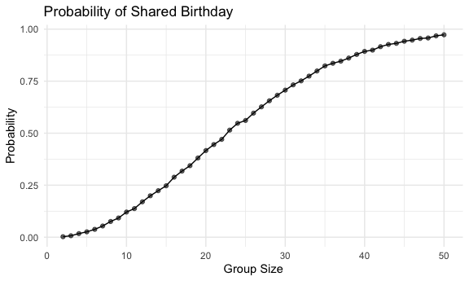
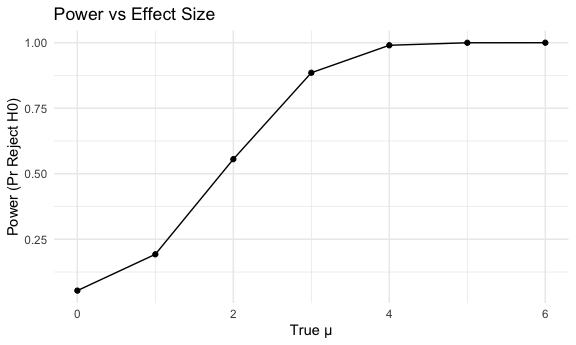
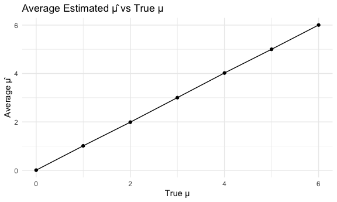
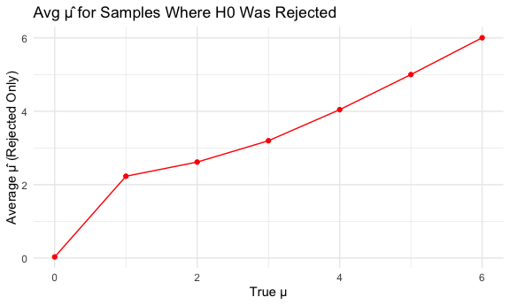
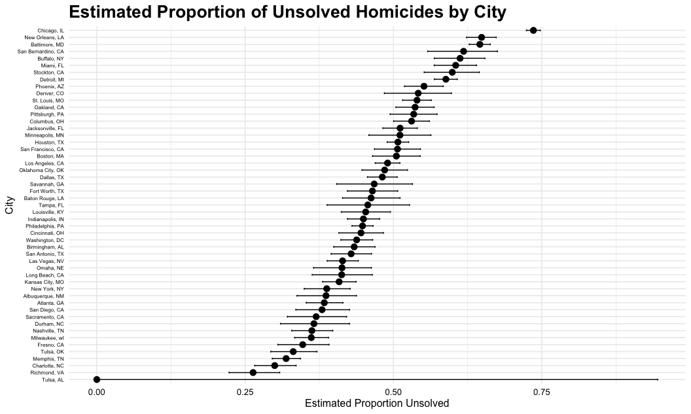

p8105_hw5_xf2302
================
Xiuhong Fan
2025-11-13

# Load Libraries and Set Seed

``` r
library(tidyverse)
```

    ## ── Attaching core tidyverse packages ──────────────────────── tidyverse 2.0.0 ──
    ## ✔ dplyr     1.1.4     ✔ readr     2.1.5
    ## ✔ forcats   1.0.0     ✔ stringr   1.5.1
    ## ✔ ggplot2   3.5.2     ✔ tibble    3.3.0
    ## ✔ lubridate 1.9.4     ✔ tidyr     1.3.1
    ## ✔ purrr     1.1.0     
    ## ── Conflicts ────────────────────────────────────────── tidyverse_conflicts() ──
    ## ✖ dplyr::filter() masks stats::filter()
    ## ✖ dplyr::lag()    masks stats::lag()
    ## ℹ Use the conflicted package (<http://conflicted.r-lib.org/>) to force all conflicts to become errors

``` r
library(broom)
library(purrr)
library(readr)
library(janitor)
```

    ## 
    ## Attaching package: 'janitor'
    ## 
    ## The following objects are masked from 'package:stats':
    ## 
    ##     chisq.test, fisher.test

``` r
knitr::opts_chunk$set(
  echo = TRUE,
  warning = FALSE,
  fig.width = 6,
  fig.asp = .6,
  out.width = "90%"
)

theme_set(theme_minimal() + theme(legend.position = "bottom"))

set.seed(8105)
```

# Problem 1

# Define Function to Check Shared Birthdays

``` r
shared_bday = function(n) {
birthdays = sample(1:365, n, replace = TRUE)
any(duplicated(birthdays))
}
```

# Run Simulations for Group Sizes 2–50

``` r
group_sizes = 2:50

results =
tibble(group_size = group_sizes) |>
mutate(prob_shared =
map_dbl(group_size,
~ mean(replicate(10000, shared_bday(.x))))
)
```

# Plot Probability vs. Group Size

``` r
results |>
ggplot(aes(group_size, prob_shared)) +
geom_line() +
geom_point(alpha = .6) +
labs(
title = "Probability of Shared Birthday",
x = "Group Size",
y = "Probability"
)
```



The probability of shared birthdays is very low for small groups but
increases quickly as group size grows. Around 23 people, the probability
passes 50%, confirming the birthday paradox. By 40–50 people, the
probability is very high. The simulation matches the well-known pattern
that shared birthdays occur more often than intuition suggests.

# Problem 2

# Design Parameters (n, σ) and Simulation Function

``` r
n = 30
sigma = 5

sim_one = function(mu) {
  x = rnorm(n, mean = mu, sd = sigma)
  t_out = t.test(x, mu = 0)
  
  tibble(
    mu_hat = mean(x),
    p_value = t_out$p.value
  )
}
```

# Generate Simulation Grid and Run 5000 Iterations

``` r
mu_values = 0:6
n_iter = 5000

sim_results =
  expand_grid(
    mu = mu_values,
    iter = 1:n_iter
  ) |>
  mutate(
    results = map(mu, sim_one)
  ) |>
  unnest(results)
```

# Plot: Power vs Effect Size

``` r
power_df =
  sim_results |>
  mutate(reject = p_value < 0.05) |>
  group_by(mu) |>
  summarize(power = mean(reject))

power_df |>
  ggplot(aes(x = mu, y = power)) +
  geom_line() +
  geom_point() +
  labs(
    title = "Power vs Effect Size",
    x = "True μ",
    y = "Power (Pr Reject H0)"
  )
```



Power increases as μ increases because larger effect sizes give the test
greater ability to detect a deviation from 0. When μ is small, rejection
rates remain low, but as μ grows the null becomes easier to reject and
power rises toward 1.

# Plot: Average μ̂ Across All Samples

``` r
sim_results |>
  group_by(mu) |>
  summarize(avg_mu_hat = mean(mu_hat)) |>
  ggplot(aes(x = mu, y = avg_mu_hat)) +
  geom_point() +
  geom_line() +
  labs(
    title = "Average Estimated μ̂ vs True μ",
    x = "True μ",
    y = "Average μ̂"
  )
```



# Plot: Average μ̂ for Rejected Samples Only

``` r
sim_results |>
  mutate(reject = p_value < 0.05) |>
  filter(reject) |>
  group_by(mu) |>
  summarize(avg_mu_hat_rejected = mean(mu_hat)) |>
  ggplot(aes(x = mu, y = avg_mu_hat_rejected)) +
  geom_point(color = "red") +
  geom_line(color = "red") +
  labs(
    title = "Avg μ̂ for Samples Where H0 Was Rejected",
    x = "True μ",
    y = "Average μ̂ (Rejected Only)"
  )
```



The overall average of μ̂ closely matches the true μ, showing that the
estimator is unbiased. However, when considering only samples in which
the null was rejected, the average μ̂ is higher than the true μ for small
effect sizes. This occurs because significant results are more likely
when μ̂ is an unusually large positive estimate, creating selection bias.

# Problem 3

# Load and Clean Raw Data

``` r
homicide_df =
  read_csv("data/homicide-data.csv") |> 
  clean_names() |> 
  mutate(
    city_state = str_c(city, ", ", state),
    unsolved = if_else(
      disposition %in% c("Closed without arrest", "Open/No arrest"),
      1, 0
    )
  )
```

    ## Rows: 52179 Columns: 12
    ## ── Column specification ────────────────────────────────────────────────────────
    ## Delimiter: ","
    ## chr (9): uid, victim_last, victim_first, victim_race, victim_age, victim_sex...
    ## dbl (3): reported_date, lat, lon
    ## 
    ## ℹ Use `spec()` to retrieve the full column specification for this data.
    ## ℹ Specify the column types or set `show_col_types = FALSE` to quiet this message.

The raw dataset contains 52,179 homicide cases from 50 large U.S.
cities, with each row representing a single victim. The variables
include information on the city and state, victim demographics,
geographic location, the date of the homicide, and the case disposition.
This structure allows us to examine how homicide characteristics and
outcomes vary across cities.

# Summarize Homicides per City

``` r
city_summary =
  homicide_df |> 
  group_by(city_state) |> 
  summarize(
    total = n(),
    unsolved = sum(unsolved),
    .groups = "drop"
  )
```

# Single-City Example: Baltimore, MD

``` r
baltimore =
  city_summary |> 
  filter(city_state == "Baltimore, MD")

baltimore_test = prop.test(baltimore$unsolved, baltimore$total)

baltimore_tidy = broom::tidy(baltimore_test)
baltimore_tidy
```

    ## # A tibble: 1 × 8
    ##   estimate statistic  p.value parameter conf.low conf.high method    alternative
    ##      <dbl>     <dbl>    <dbl>     <int>    <dbl>     <dbl> <chr>     <chr>      
    ## 1    0.646      239. 6.46e-54         1    0.628     0.663 1-sample… two.sided

# Run prop.test for All Cities

``` r
results_all_cities =
  city_summary |> 
  mutate(
    test_result = map2(unsolved, total, prop.test),
    tidy_output = map(test_result, broom::tidy)
  ) |> 
  unnest(tidy_output)
```

# Plot: Proportion of Unsolved Homicides by City (With CI)

``` r
results_all_cities |> 
  mutate(
    city_state = fct_reorder(city_state, estimate)
  ) |> 
  ggplot(aes(x = estimate, y = city_state)) +
  
  geom_errorbarh(aes(xmin = conf.low, xmax = conf.high),
                 height = 0.25, color = "black") +
  
  geom_point(color = "black", size = 3) +
  
  labs(
    title = "Estimated Proportion of Unsolved Homicides by City",
    x = "Estimated Proportion Unsolved",
    y = "City"
  ) +
  
theme_minimal(base_size = 12) +
  theme(
    axis.text.y = element_text(size = 6, colour = "black"),
    axis.text.x = element_text(size = 10, colour = "black"),
    plot.title  = element_text(size = 20, face = "bold", colour = "black"),
    legend.position = "none"
  )
```



This plot shows the estimated proportion of unsolved homicides for major
U.S. cities, with each point representing an estimate and horizontal
error bars indicating the confidence intervals. Cities are ordered from
lowest to highest unsolved rate, making cross-city comparisons
straightforward. The visualization highlights substantial variation in
homicide clearance rates, with a clear gap between the lowest and
highest cities.
